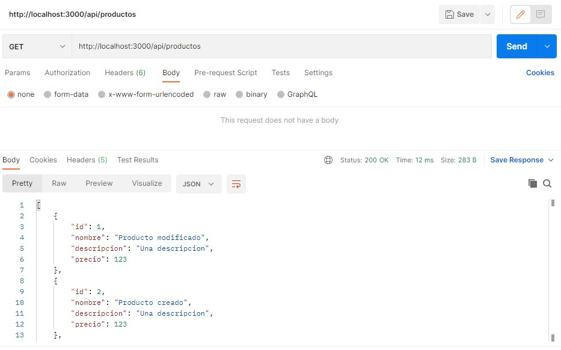
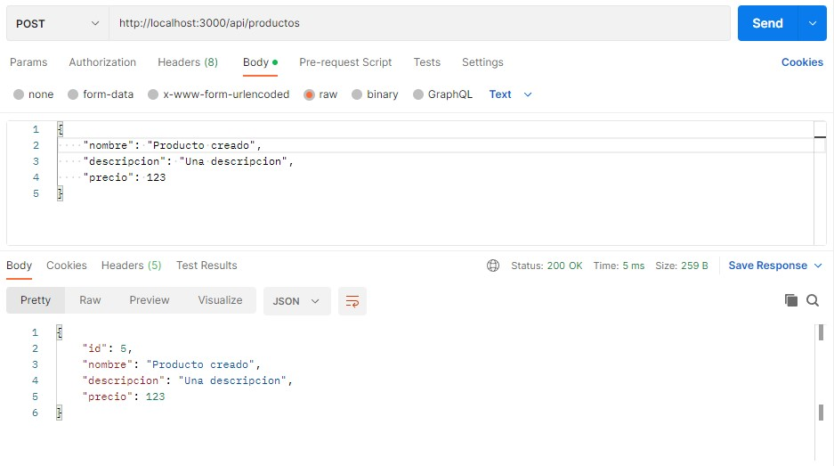
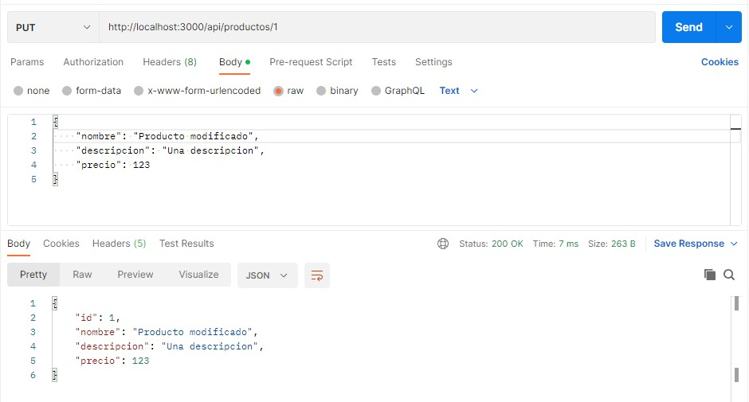

# Desafío: Crear un servidor API Restful con Deno Oak

## Consignas:

Crear un servidor API Restful con Deno Oak que permita:

* Incorporar productos con su nombre, descripción y precio.
* Listar los productos totales y por su id.
* Modificar un producto por su id.
* Borrar un producto por su id.
* Utilizar denon para el reinicio del servidor en caso de cambiar el código fuente.
* Centralizar el uso de las dependencias en un sólo archivo deps.ts
* Utilizar postman para enviar todos los request http a la ruta '/api/productos' y también el navegador para visualizar la lista cargada.

### Running the app:

---

`$ denon start`

### Capturas de las API:

